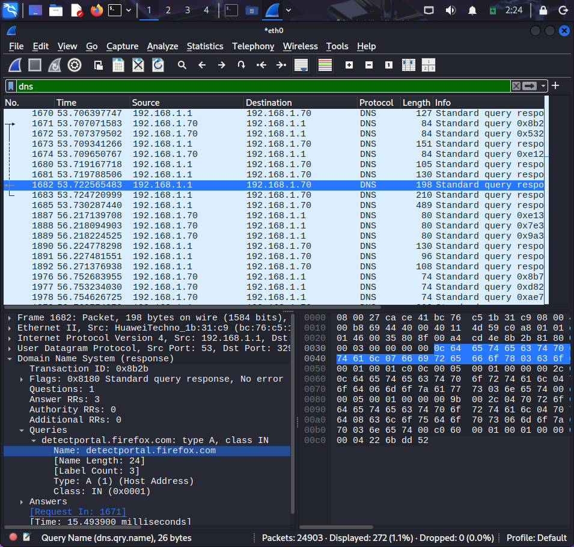
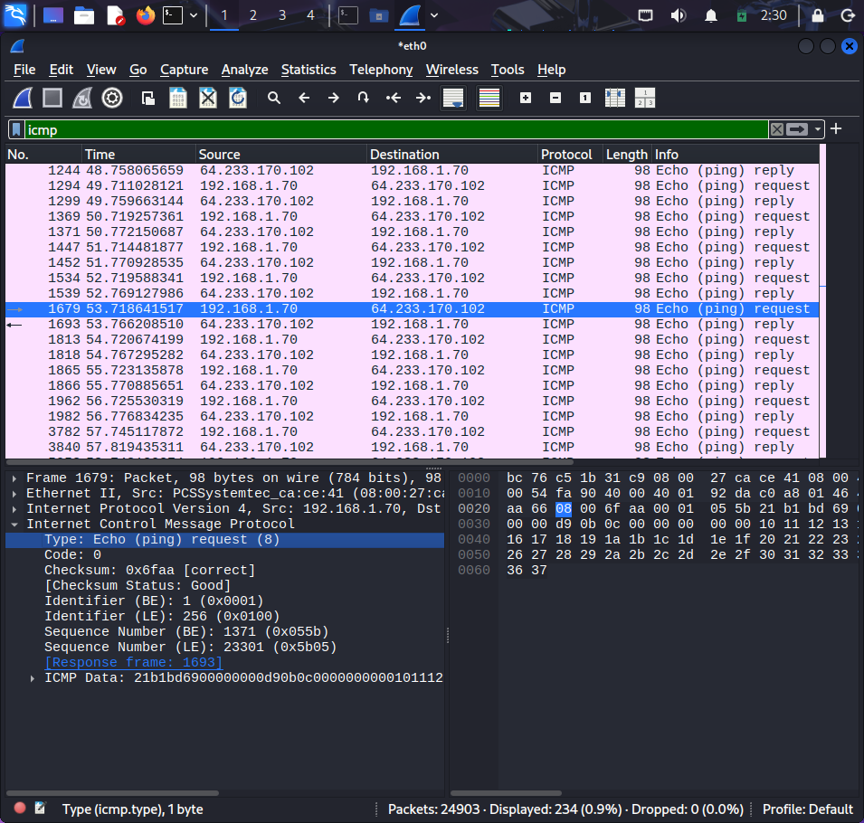
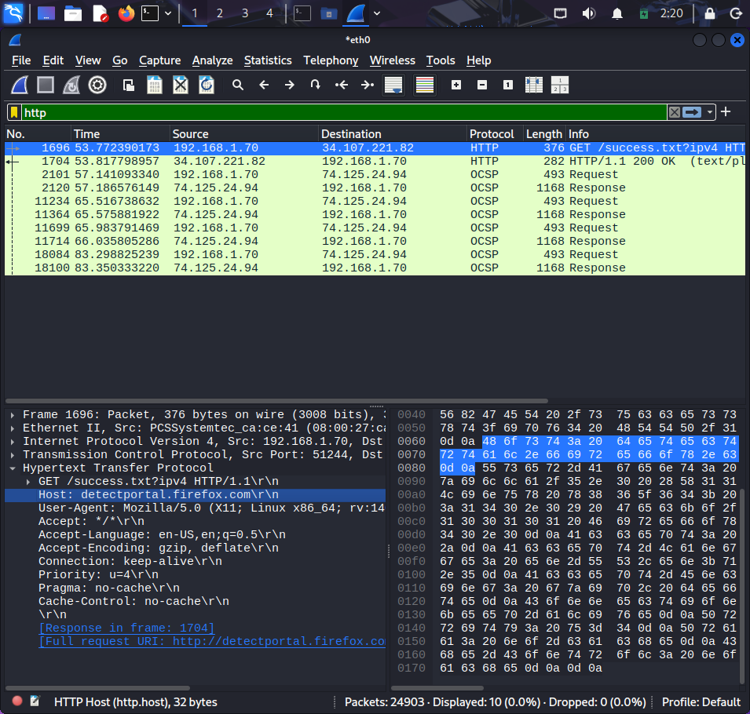
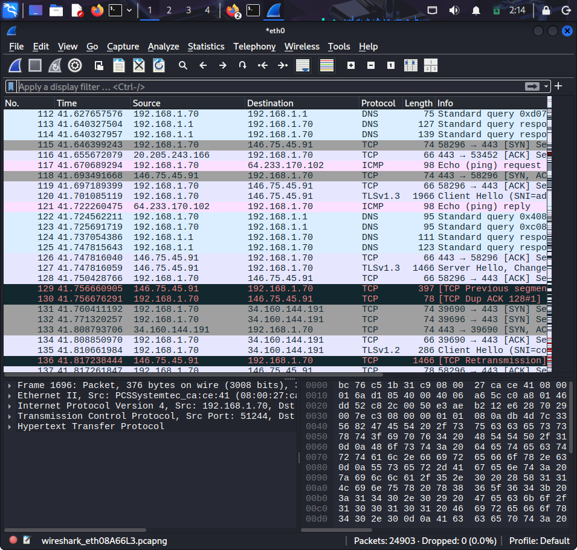

# Wireshark Network Traffic Analysis

## Objective
Capture and analyze network packets using Wireshark.

## Tools Used
- Wireshark

## Steps
1. Captured live traffic
2. Applied filters (DNS, HTTP, ICMP)
3. Analyzed packet details

## Files
- capture.pcapng
- analysis.txt

## Screenshots

### DNS Analysis

### ICMP Analysis

### HTTP Analysis

### Capture Details

## Conclusion
This project demonstrates basic packet analysis skills.
